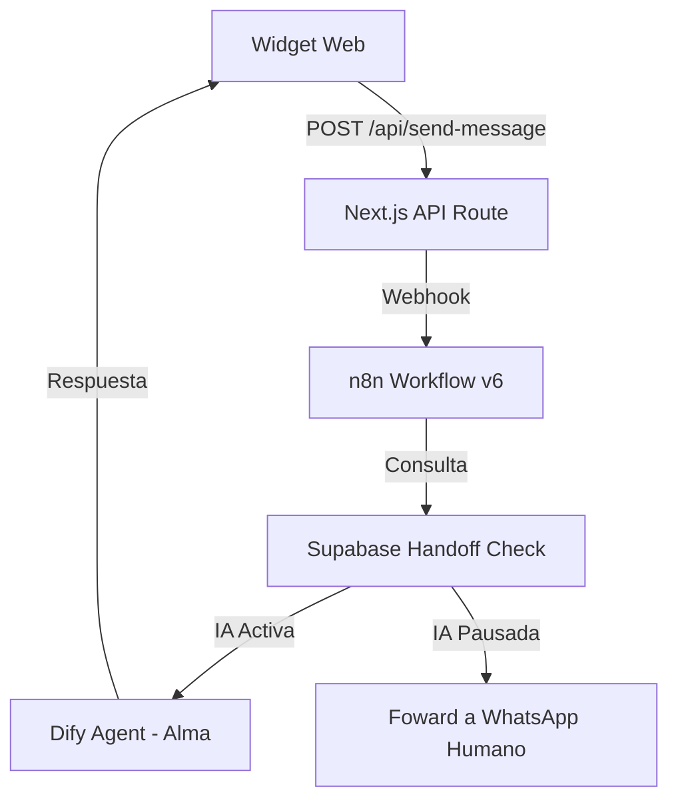

# 🧠 Proyecto: Joyería Alianza — Inteligencia del Proyecto

Este documento consolida el conocimiento total del proyecto **Joyería Alianza (AurumLuz Digital)**, basado en la documentación técnica, historial de errores, estrategias de negocio y prompts de IA encontrados en el repositorio.

---

## 1. Visión General
**AurumLuz Digital / Joyería Alianza** es una plataforma de e-commerce de lujo especializada en joyería artesanal (oro 18K y plata 925), alianzas y anillos de compromiso, enfocada al mercado uruguayo. Su núcleo técnico combina **Next.js**, **WooCommerce**, **n8n** y **IA (Dify/Gemini)** para ofrecer una experiencia de venta asistida 24/7.

### Identidad Visual
- **Primario:** Oro (#D4AF37) - Lujo.
- **Fondo:** Off-white (#F8F7F6) - Modernidad.
- **Acento:** Soft Green (#6B9080) - CTA/Highlights.
- **Tipografía:** Playfair Display (Headlines) & Manrope (Body).

---

## 2. Arquitectura Técnica

### Stack de Tecnologías
- **Frontend:** Next.js (App Router), Tailwind CSS, Lucide React, Shadcn UI.
- **Backend/Integración:** n8n (Orquestador de flujos).
- **IA:** Dify (Motor de agentes) usando Google Gemini.
- **Base de Datos:** Supabase (Estado de handoff, persistencia).
- **E-commerce:** WooCommerce (Catalog y órdenes).
- **Comunicación:** WhatsApp via Evolution API.
- **Hosting:** Hostinger (Entorno serverless/compartido).

### Flujo de Datos del Chat

---

## 3. Inteligencia del Negocio y Ventas

### El Agente "Alma"
Alma no es un "bot", es una asesora cálida y elegante que sigue un proceso de 4 fases:
1.  **Recepción:** Conexión emocional inmediata, mención del producto.
2.  **Calificación:** Entender la ocasión (boda, regalo, aniversario) y para quién es.
3.  **Generación de Deseo:** Storytelling del producto (oro 18K, artesanal).
4.  **Handoff Activo:** Traspaso a asesor humano en WhatsApp cuando detecta señales de compra ("me interesa", "precio").

### Estrategia de Mercado (Uruguay)
- Foco en PYMES de Montevideo.
- Venta de "tranquilidad y eficiencia" sobre "tecnología".
- Concepto de "Empleado Digital" que no duerme.
- Puntos de dolor: Ventas perdidas por demora en respuesta, consultas repetitivas.

---

## 🗺️ Mapa Detallado de Documentación

A continuación se detalla la ubicación y propósito de cada archivo clave en el ecosistema del proyecto:

| Área | Archivos | Contenido Detallado |
| :--- | :--- | :--- |
| **Blueprint** | `blueprint.md` | **Diseño visual:** Colores Gold/Off-white/Soft Green, fonts Playfair+Manrope. **Features:** boutique virtual, try-on virtual, recomendaciones IA. |
| **Chat Web ↔ WhatsApp** | `configuracion-chat.md` | **Arquitectura:** Flujo Web → n8n → Dify/WhatsApp. Especificación de Endpoints y payloads JSON (eventos, metadatos). |
| **Histórico de Bugs** | `historico-fix-chat-web.md`, `reporte_chat_n8n.md.resolved` | **Fixes Críticos:** Doble respondToWebhook, `messageStore` volátil en Hostinger, `UnrecognizedActionError` por hashes de Server Actions, stale closures en React y scroll automático. |
| **Error 503** | `resolucion-tecnica-503.md` | **Resiliencia:** Cache L1 en memoria RAM, timeout de 15s (`AbortSignal`) y estrategia `stale-if-error` (fallback de 10 min) para proteger de latencia en WooCommerce. |
| **Flujos n8n** | `n8n-flujo-chat-v4.json`, `n8n_flujo_v5_resiliente.json`, `n8n_flujo_v6_handoff.json`, `resumen_mejoras_n8n.md` | **Evolución:** v4 (estabilidad) → v5 (resiliencia/blocking) → v6 (Handoff inteligente). Manejo de fallback a mensaje de "alta demanda". |
| **Handoff SQL** | `sql_handoff_table.sql` | **Persistencia:** Tabla `chat_handoff` en Supabase. Columnas para `is_paused`, `resume_at` y disparadores para auto-actualización del estado de la IA. |
| **Agente Alma (IA)** | `promp agente logica.txt`, `agente ai/promp agente 1.md`, `agente ai/promp agente 2.md`, `agente ai/promp agente logica.md` | **Lógica de Conversación:** 3 versiones del prompt. Estrategia de 4 fases (Recepción → Calificación → Deseo → Handoff) para maximizar la conversión. |
| **Testing del Agente** | `agente ai/alma-agent-testing-guide.md` | **Validación:** 8 bloques de prueba (Happy Path, atajos, inyección de prompt, alucinaciones de datos, off-topic y efectividad de handoff). |
| **Chat Widget** | `chat-widget.tsx`, `walkthrough.md.resolved`, `implementation_plan.md.resolved` | **Frontend:** Componente React con onboarding inline, consola de monitoreo de tráfico, indicador de escritura e integración con API Route. |
| **Plan Estratégico** | `plan_estrategico_startup_uy.md` | **Estrategia Startup:** Guía para PYMES en Montevideo, definición de avatares (Comerciante, Clínica, Inmobiliaria) y stack low-code detallado. |

---

## 4. Estabilidad y Resiliencia (Lecciones Aprendidas)

### Prevención de Error 503 (WooCommerce/Hostinger)
- **Cache L1:** Map en memoria RAM del servidor con TTL de 2 min.
- **Timeout Estricto:** 15s para llamadas a WooCommerce.
- **Stale-if-error:** Si el backend falla, sirve data vieja (hasta 10 min) para no romper la tienda.
- **Payload reducido:** Máximo 20 productos por página para evitar saturación de RAM.

### Soluciones de Chat
- **API Routes vs Server Actions:** Se migró a `/api/send-message` porque los Server Actions en Hostinger generaban `UnrecognizedActionError` tras cada deploy por cambios en los hashes.
- **Concurrencia en n8n:** Se eliminó el doble `respondToWebhook` para evitar respuestas vacías.
- **Handoff Inteligente:** Si un humano responde por WhatsApp, la IA se pausa automáticamente por 30 minutos (vía Supabase).

---

## 5. Componentes Clave del Repositorio

| Archivo/Carpeta | Propósito |
|---|-|
| `src/components/chat-widget.tsx` | Widget de chat con consola debug y onboarding inline. |
| `src/lib/woocommerce.ts` | Lógica de fetch resiliente con cache y timeouts. |
| `docs/n8n_flujo_v6_handoff.json` | Flujo de n8n más avanzado con integración Supabase. |
| `docs/agente ai/` | Prompts especializados y guías de testing para el agente Alma. |
| `sql_handoff_table.sql` | Definición de la tabla para control de pausa de IA. |

---

## 6. Próximos Pasos Identificados
- [ ] Implementar Redis para persistencia de cache más robusta (fuera de memoria RAM).
- [ ] Mejorar el polling de mensajes entrantes (actualmente fetch cada 2.5s).
- [ ] Configurar `WEBHOOK_SECRET` para mayor seguridad en n8n.
- [ ] Implementar Server-Sent Events (SSE) para el stream de la IA.

---
*Documento generado por Antigravity — 20 de Febrero, 2026*
